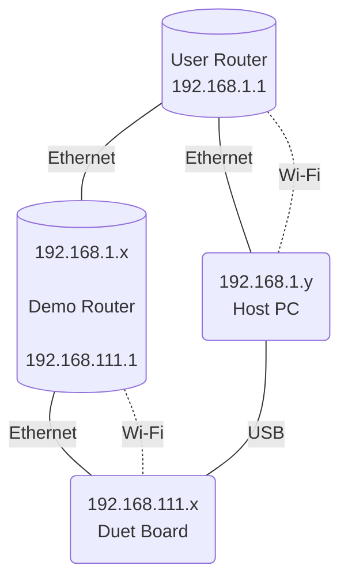

### Demo Router

#### Hardware

The **Demo Router** is constructed from the following components:

- Raspberry Pi 4B
- MicroSD card, at least 256MB
- PAU0A Wi-Fi USB Adapter (optional)
- UGREEN USB-A 3.0 To Gigabit Ethernet Adapter (CR111/20256) or other AX88179-based adapters (optional)

#### Preparation

Simply image the microSD card with the OpenWRT-based [backup.img.gz](./backup.image.gz). Depending on the tool, you might need to decompress the file first.

Connect the PAU0A Wi-Fi USB Adapter and UGREEN USB-A 3.0 To Gigabit Ethernet Adapter (CR111/20256), if any, to one of the Raspberry Pi's USB ports.

The optional *PAU0A Wi-Fi USB Adapter* is needed for testing enterprise Wi-Fi, and the optional *UGREEN USB-A 3.0 To Gigabit Ethernet Adapter (CR111/20256)* is needed when using an Ethernet Duet Board. Using other USB to Wi-Fi/Ethernet adapter is ok, though you might need to install the appropriate OpenWRT drivers.

#### Setup

Connect the prepared **Demo Router** to your router/switch.

The diagram above assumes the user network is `192.168.1.0/24`, with the **User Router** at `192.168.1.1`. Both **Host PC** and **Demo Router** is connected to user network, getting IP addresses `192.168.1.x` and `192.168.1.y`, respectively via DHCP. **Host PC** can be connected to user network either via Ethernet or Wi-Fi.

**Demo Router** in turn, creates a network `192.168.111.0/24` with its IP at `192.168.111.1`. It also creates access points the **Duet Board** can connect to, see [wifi/README.md](wifi/README.md) for more details. If **Duet Board** connects to **Demo Router**, it gets its address `192.168.111.x` via DHCP.

**Host PC** is connected to the **Duet Board** to issue GCode commands via USB-Serial connection.

### Notes

- **Demo Router** hostname is `demo-router`.
- **Host PC** can access the **Demo Router** web GUI through `http://demo-router`. There is no password, just press the `Login` button.
- Host PC can *ssh* into **Demo Router** using `ssh root@demo-router`.